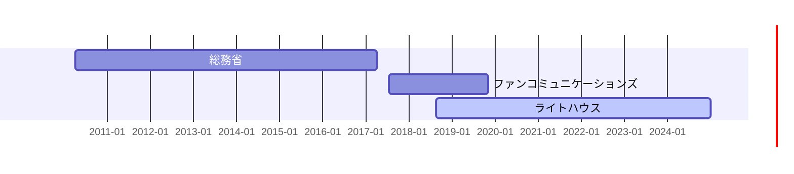

# 職務経歴書

## 🙋‍♂️ はじめに

- フルスタックに大体なんでもいけます。
  - インフラ（AWS）
  - バックエンド（全般）
  - フロントエンド（Web, Android）
  - データ分析
- カチカチに凝り固まった技術的負債をなんとかし、心理的安全性を持って継続的にデプロイできるようにしていくようなことばかりをやっています。

## 📚 スキル

## 📆 年表

## 📰 職務経歴

## 株式会社ライトハウス

| 職種 | エンジニア |
| ---- | ---- |
| 期間 | 2018年8月〜2019年10月（業務委託） |
|  | 2019年11月〜現在（社員） |
| 業務 | 漁業者向けの船舶プラットフォームの開発 |

- API開発
  - Ruby on Rails
  - Golang Gin
  - Golang GRPC
  - Python FastAPI
  - ECS, API Gateway
- 社内向けの管理画面のフロントエンド開発
  - Vue.js
  - Nuxt.js
  - Javascript
- 社内向けのスクレイピングツールの開発
  - Python, FastAPI
  - Vue.js
  - Nuxt.js
  - Typescript
- エンドユーザ向けGISフロントエンド開発
  - Typescript
  - vite
  - react
- IoTデバイスとして海上で動作するRaspberry PIの上のアプリケーションの開発
  - 言語
    - Python
    - Golang
  - 数百台規模のIoTデバイスのプログラムのアップデート基盤の構築
    - コード管理すらされていない状況からスタート
  - プログラムのログを低コストでサーバー側にアップロードする仕組みの構築
    - 電源がOFFの状態でもログによる調査が可能となる
  - 圏外時のデータをIoTデバイスに保存しておき、電波がある時にデータを送る仕組みの構築
- [Terraform](https://www.terraform.io/)を用いたAWSインフラの全般の構築
- [Serverless](https://www.serverless.com/)を用いたAWS Lambdaの構築
  - Python
  - Golang
- マイクロサービスごとにCI/CDを構築
  - TerraformのDaily差分チェックする仕組み
  - SecurityTestをDailyで回す仕組み
- モニタリング環境の構築・メンテナンス（Datadog）
- 業務委託エンジニアとの調整
- コスト削減
  - Auto Scaling調整
  - CloudWatch Logs（S3 Export、保存期間の調整）
  - ECSのSpotInstance化
  - S3 LifeCycle Policyの設定
  - RDBアクセス用のBastionのCloudshell化
- 社内向け分析ツールの構築
  - Bigqueryへのデータexport
  - batchの作成
    - MWAA
    - Lambda
  - ECSによるRedashの構築
  - クエリ作成
  - ダッシュボードの作成
- 外注していたAndroidアプリの内製化
  - 担当者等の変遷により外注先でバグ修正ができなくなったことを契機に自身で一から巻き取り

## 株式会社ファンコミュニケーションズ

| 職種 | エンジニア |
| ---- | ---- |
| 期間 | 2017年7月~2019年10月 |
| 業務 | 広告配信プラットフォームの開発 |

- 広告配信用の社内管理ツールのWebサービス開発
  - CakePHP2
  - jQuery
  - MySQL
- 広告配信基盤の開発
  - Scala
- 広告配信データの分析・機械学習
  - Python
  - Jupyter Notebook
  - Treasure Data

## 総務省

| 職種 | 行政官 |
| ---- | ---- |
| 期間 | 2010年4月~2017年3月 |
| 業務 | 事務一般 |

- 固定通信市場（固定電話・光ファイバー市場）における競争環境の整備に関する業務
- 法案制定業務、法令審査業務、訴訟対応業務等
- モバイル通信市場（格安SIM市場）における競争環境の整備に関する業務
- ４Ｋ・８Ｋ放送の国際展開業務、衛星放送事業者に対する許認可業務、衛星放送事業の収支統計業務、予算関係業務、海外法令の調査業務

## その他

ポリシー：違和感は信じる。直感は疑う。

アイコン：てんとう虫はアブラムシ(bug)を食べる虫。「バグが減りますよう」にという願掛け。
