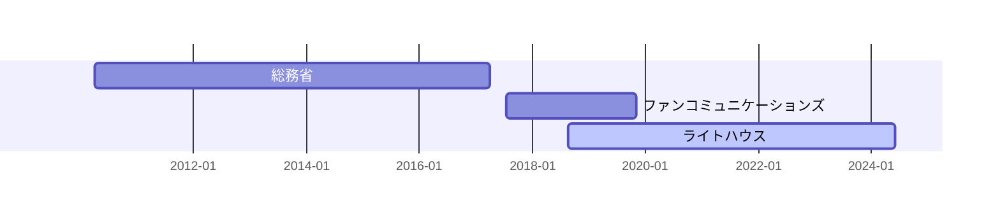

# 職務経歴書
## 🙋‍♂️ はじめに
- インフラ、バックエンド、フロントエンド、データ分析、大体なんでもいけます

## 📆 年表

```mermaid
gantt
    dateFormat YYYY-MM-DD
    axisFormat  %Y-%m
    総務省 :job1, 2010-04-01,2017-03-31
    ファンコミュニケーションズ　:job2, 2017-07-15,2019-10-31
    ライトハウス　: active, job3, 2018-08-15, 2024-05-31
```

## 📰 職務経歴
### 株式会社ライトハウス
職務：エンジニア \
期間：2018年8月〜2019年10月（業務委託）\
　　：2019年11月〜現在（社員）\
業務：漁業者向けの船舶プラットフォームの開発（創業初期から従事）
- API開発（Ruby on Rails, Golang, Python）
- 社内向けの管理ツールのフロントエンド開発（Vue.js, Nuxt.js, Javascript）
- 社内向けのスクレイピングツールの開発（Python, FastAPI, Vue.js, Nuxt.js, Typescript）
- エンドユーザ向けGISフロントエンド開発（Typescript, vite, react）
- IoTデバイスとして海上で動作するRaspberry PIの上のアプリケーションの開発（Python, Golang）
    - 数百台規模のIoTデバイスのプログラムのアップデート基盤の構築
    - プログラムのログを低コストでサーバー側にアップロードする仕組みの構築
        - 電源がOFFの状態でもログによる調査が可能となる
    - 圏外時のデータをIoTデバイスに保存しておき、電波がある時にデータを送る仕組みの構築
- [Terraform](https://www.terraform.io/)を用いたAWSインフラの構築
- [Serverless](https://www.serverless.com/)を用いたAWS Lambdaの構築（Python, Golang）
- マイクロサービスごとにCI/CDを構築
    - TerraformのDaily差分チェックする仕組み
    - SecurityTestをDailyで回す仕組み
- モニタリング環境の構築・メンテナンス（Datadog）
- 業務委託エンジニアとの調整
- コスト削減
    - Auto Scaling調整
    - CloudWatch Logs（S3 Export、保存期間の調整）
    - ECSのSpotInstance化
    - S3 LifeCycle Policyの設定
- Redashの構築、クエリ作成、ダッシュボードの作成

### 株式会社ファンコミュニケーションズ
職務：エンジニア \
期間：2017年7月~2019年10月 \
業務：広告配信プラットフォームの開発
- 広告配信用の社内管理ツールのWebサービス開発（CakePHP2, jQuery, MySQL）
- 広告配信基盤の開発（Scala）
- 広告配信データの分析・機械学習（Python, Jupyter Notebook）

### 総務省
職務：事務官\
期間：2010年4月~2017年3月
- 固定通信市場（固定電話・光ファイバー市場）における競争環境の整備に関する業務
- 法案制定業務、法令審査業務、訴訟対応業務等
- モバイル通信市場（格安SIM市場）における競争環境の整備に関する業務
- ４Ｋ・８Ｋ放送の国際展開業務、衛星放送事業者に対する許認可業務、衛星放送事業の収支統計業務、予算関係業務、海外法令の調査業務

## その他
ポリシー：違和感は信じる。直感は疑う。\
アイコン：てんとう虫はアブラムシ(bug)を食べる虫。「バグが減りますよう」にという願掛け。
